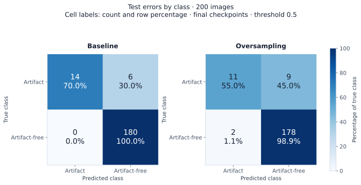
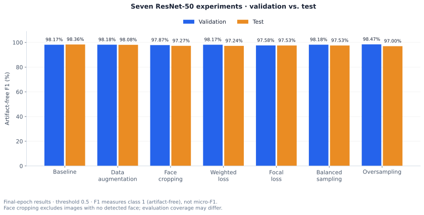
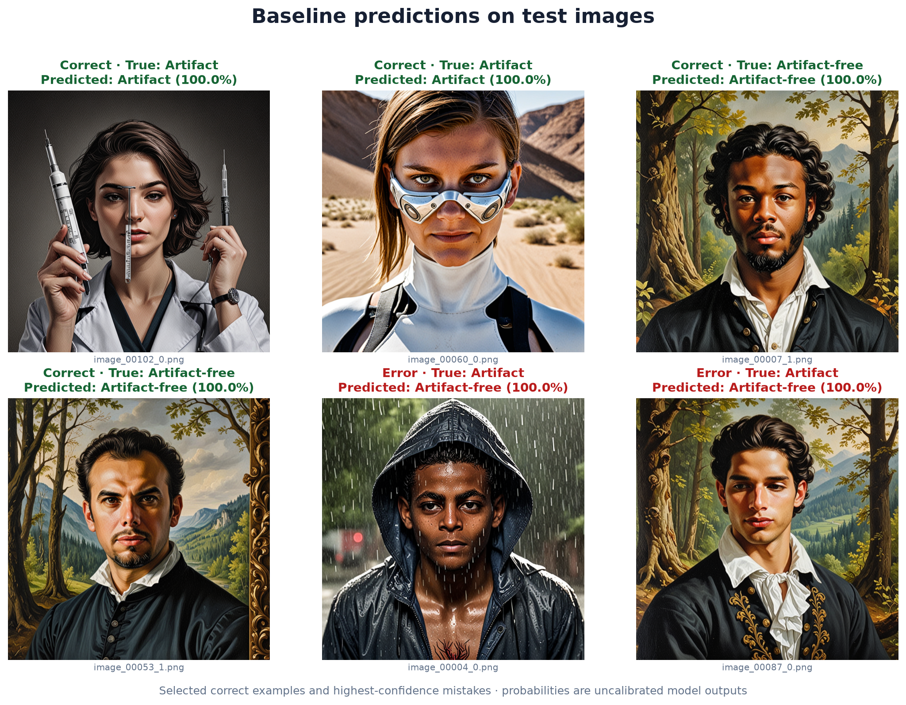
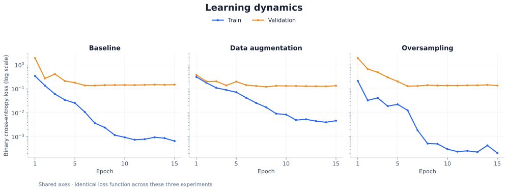
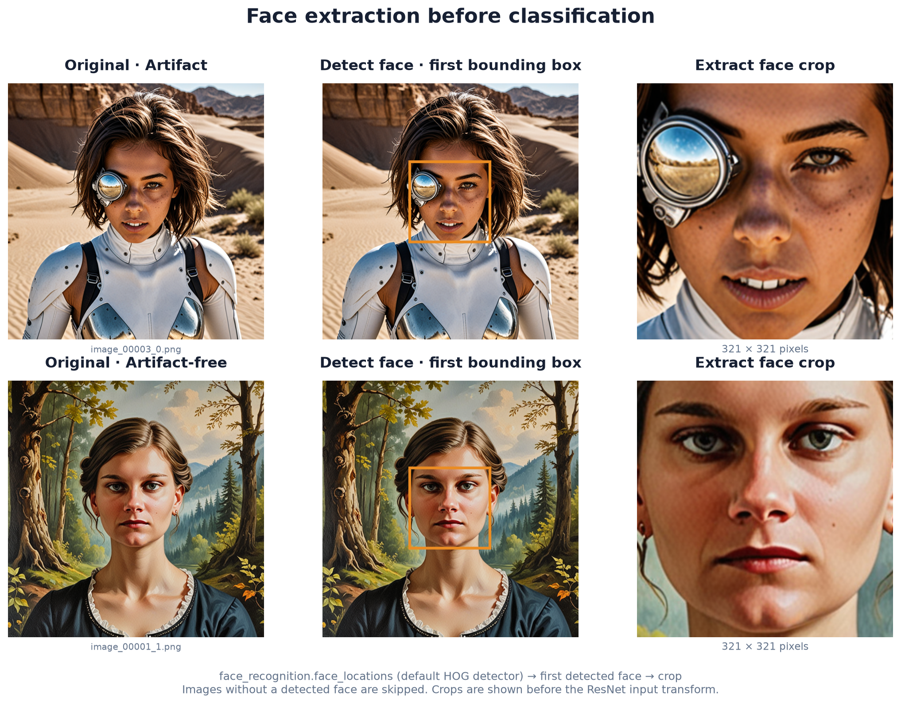

# Generated Image Artifact Classification

A Kaggle-like challenge to train the best possible binary classifier for **generated images**. Some images contain artifacts such as text, hands or fingers, pieces of face masks, tattoos, or eyes not looking at the camera. The model predicts **artifact (`0`)** or **artifact-free (`1`)**.

The task requires functions to **train, validate, and infer**, with **micro F1 as the single required and primary metric**. Other metrics are optional diagnostics. The advanced extension is to explore distinct approaches and optionally combine them into an ensemble. This project compares seven ResNet-50 approaches under a **9:1 class imbalance**; an ensemble has not been implemented.

**Baseline test micro F1: 98.36%**, calculated from 194 correct predictions out of 200 test images.



[Notebook](main.ipynb) · [Training code](src/training.py) · [Figure generation](generate_visualizations.py)

## Primary results: micro F1

For single-label classification across both classes, micro F1 equals the fraction of correct predictions. These scores are calculated from the existing confusion matrices using **final checkpoints and threshold 0.5**:

| Experiment | Correct predictions | Test micro F1 (%) |
| --- | ---: | ---: |
| Baseline | 194 / 200 | **98.36** |
| Oversampling | 194 / 200 | 98.37 |

**Metric implementation note:** the current training code calls `binary_f1_score`, so the saved `test_micro_f1` field actually contains **artifact-free binary F1**. Micro F1 for the other five experiments is unavailable in the saved summaries; the secondary scores below cannot establish their ranking on the required metric.

## Approach comparison: secondary F1

The table and plot show **artifact-free F1**, taken from `runs/<experiment>/training_results.json` at the final epoch and threshold 0.5.



| Experiment | Implementation | Validation artifact-free F1 (%) | Test artifact-free F1 (%) |
| --- | --- | ---: | ---: |
| Baseline | Default transforms + BCE | 98.17 | **98.36** |
| Augmentation | Horizontal flip + mild color jitter + alternate resize | 98.18 | 98.08 |
| Face cropping | First detected face as input | 97.87 | 97.27 |
| Weighted BCE | `pos_weight=1/9` | 98.17 | 97.24 |
| Focal Loss | `alpha=0.25`, `gamma=2.0` | 97.58 | 97.53 |
| Balanced sampling | Class weights `[9, 1]`; original epoch length | 98.18 | 97.53 |
| Oversampling | Inverse-frequency weights; `2 × largest_class_count` draws | **98.47** | 97.00 |

Weighted BCE downweights the majority class's positive-target term because artifacts carry label `0`. Both sampling methods draw with replacement; oversampling also increases optimizer updates per epoch. Focal Loss reduces the contribution of easy examples.

**Takeaway:** oversampling improved final validation artifact-free F1, but lowered test micro F1 from **97.00% to 94.50%** compared with the baseline.



Both displayed mistakes are artifacts predicted as artifact-free with scores rounding to 100.0%. These uncalibrated outputs show why confident errors need inspection alongside aggregate metrics.

</details>

## Learning dynamics



Baseline training BCE falls to **0.00066**, while final validation BCE remains **0.1517**; minimum validation loss occurs at epoch **7**. This gap suggests overfitting. Augmentation lowers test BCE from **0.2216 to 0.1987**, but slightly lowers artifact-free F1 at threshold 0.5. Better loss does not necessarily improve thresholded decisions. Weighted BCE and Focal Loss use different loss scales and should not be compared directly with ordinary BCE.

## Data and pipeline

```text
Filename labels → class-wise validation split → training duplicate cleanup
                → transforms / optional face crops → ResNet-50 fine-tuning
                → sigmoid + threshold → metrics and error review
```

- **Dataset:** 2,000 RGB PNGs at 1024 × 1024; supplied train/test sizes are 1,800/200, both with a 9:1 artifact-free/artifact ratio.
- **Validation:** 10% sampled separately from each training class, giving 18 artifacts and 162 artifact-free images.
- **Duplicate analysis:** perceptual hashing tested distance thresholds 3, 5, 7, and 9. Threshold 3 was selected; cleanup removed 25 training images, leaving **1,595**.
- **Preprocessing:** the pretrained weights' transform provides a 224 × 224 center crop and ImageNet normalization. Augmentation adds horizontal flips (`p=0.5`) and mild color jitter, and also changes the training resize/crop path.
- **Face extraction:** the default HOG detector in `face_recognition` supplies the first face crop. Images without a detected face are skipped, so evaluation coverage may differ.

<summary>Face-cropping examples</summary>



</details>

**Training:** all ResNet-50 parameters are fine-tuned from `IMAGENET1K_V2` weights with a single-logit output, Adam (`lr=0.001`), batch size 128, and 15 epochs. `StepLR` reduces the learning rate by 10× every five epochs. Shared configuration and loops save per-epoch histories, test metrics, and checkpoints for each experiment.

**Functions:** `train_model` / `train_loop` handle training, `valid_loop` handles validation and test evaluation, and `run_inference` in the visualization script loads the baseline and oversampling checkpoints for batched inference.

**Stack:** Python, PyTorch, Torchvision, Torcheval, Pillow, NumPy, Matplotlib, `imagededup`, `face_recognition`/dlib, and Jupyter/Colab.

## Limitations and next steps

- **Complete primary-metric reporting:** switch evaluation to micro F1 across both classes and reevaluate all saved checkpoints before selecting the best approach on the required metric.
- **Small evaluation set:** only 20 test artifacts; one detection changes recall by 5 percentage points. No fixed seed, repeated runs, or uncertainty estimates are recorded.
- **Split integrity:** deduplication runs within training after validation splitting; cross-split near-duplicate leakage has not been ruled out.
- **Checkpoint selection:** `min_valid_loss` is never updated, so `best.pt` is overwritten each epoch with finite validation loss. Reported results use the final model. Fix this before using validation-based checkpoint selection.
- **Further evaluation:** record face-detection coverage, tune thresholds on validation data, and assess calibration and external-data performance.

## Repository structure

```text
main.ipynb                   # Dataset analysis and experiment orchestration
src/
  config.py                  # Pretrained model, optimizer, scheduler
  constants.py               # Class labels
  dataclass.py               # Configuration and result containers
  dataset.py                 # Image loading and sampling strategies
  preprocessing.py           # Splits, duplicate handling, face crops
  training.py                # Training and evaluation loops
  utils.py                   # Plotting and result persistence
generate_visualizations.py   # Rebuild figures from saved results/checkpoints
assets/results/              # README plots and image galleries
data/                       # Local dataset; excluded from Git
runs/<experiment>/          # Local JSON histories and best.pt / last.pt
```

## Running the project

Use Python 3.10+ and open [main.ipynb](main.ipynb) from the repository. Dependencies are not pinned as a complete environment.

```bash
python -m pip install torch torchvision torcheval numpy matplotlib pillow \
    imagededup face-recognition==1.3.0 tqdm gdown jupyterlab ipywidgets
jupyter lab main.ipynb
```

The notebook includes dataset download instructions and switches into `working_dir/`. Use a working copy: splitting and deduplication move files. Change `cfg_list[5:]` to `cfg_list` to train all seven experiments.

To regenerate metric charts from the seven saved JSON summaries:

```bash
python generate_visualizations.py --metrics-only
```

Omit `--metrics-only` to also generate image galleries and confusion matrices; this requires test images and the baseline/oversampling `last.pt` checkpoints. Use `--runs-dir` and `--data-dir` for alternative paths. The script checks reproduced test F1 against saved metrics. Dataset and run artifacts must be supplied separately when absent from a checkout.
